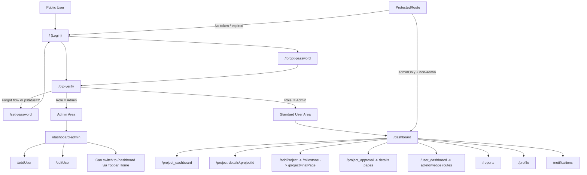

# Project Management System — App Flow

## 1) High-level Flow (Mermaid)

## 2) Screen-to-screen QA Checklist (Role-based)

### Unauthenticated User
- Open `/` -> Login page.
- Open `/forgot-password` directly.
- Open `/otp-verify` without route state -> should redirect to `/`.
- Open protected routes (`/dashboard`, `/project_dashboard`) while logged out -> should redirect to `/`.

### Forgot Password Path
1. Login -> click **Forgot Password** -> `/forgot-password`.
2. Submit username -> OTP sent -> `/otp-verify` with `ptype: "f"`.
3. OTP success -> `/set-password`.
4. Set new password -> redirect to `/`.

### Standard User Path
1. Login -> OTP verify -> `/dashboard`.
2. From dashboard:
   - project details -> `/project-details/:projectId`
   - acknowledge card -> `/user_dashboard`
3. From user dashboard:
   - project ack -> `/user_acknowledge/:projectId`
   - milestone ack -> `/user_acknowledge_milestone/:projectId/:milestoneId`
   - task ack -> `/user_acknowledge_task/:projectId/:milestoneId/:parentTaskId/:taskDtlId`
4. Access reports/profile/notifications via main navigation.

### Admin Path
1. Admin login -> OTP verify -> `/dashboard-admin`.
2. Admin operations:
   - `/addUser`
   - `/editUser`
3. Topbar switch:
   - Admin page -> Home -> `/dashboard`
   - Main page (as admin) -> Admin -> `/dashboard-admin`

### Session/Logout
- Logout clears storage and routes to `/`.
- Back-navigation into protected routes should bounce to `/`.
